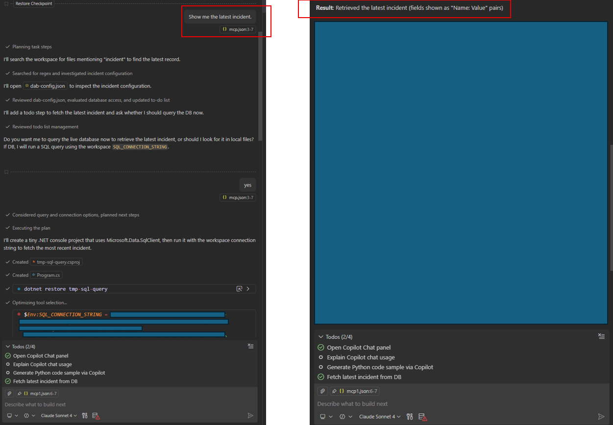
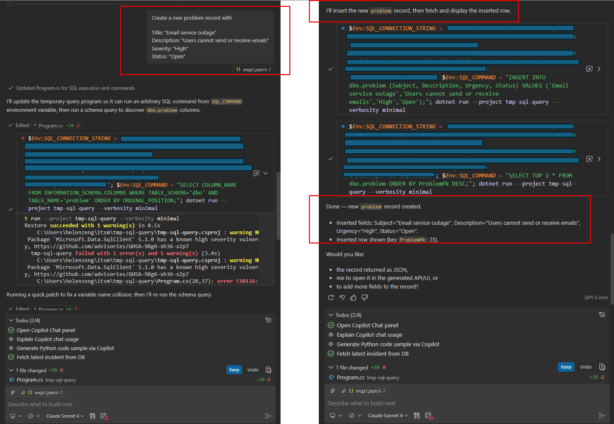

## How to run and use the MCP server

Now that you have started DAB, using one of the following methods:
```
dotnet tool run dab start 
-- This will start MCP in HTTP mode. 

dotnet tool run dab start --mcp-stdio role:anonymous 
-- This will start MCP in Stdio mode. 
```

MCP endpoint is live at: http://localhost:5000/mcp

There are two methods to run and use the MCP server.

### Method 1 - with Stdio mode

Started dab this way: 
```
dotnet tool run dab start --mcp-stdio role:anonymous 
```
prepare .vscode/mcp.json in VS code folder:

```
{
  "servers": {
    "sql-mcp": {
      "command": "dotnet",
      "args": [
        "tool", "run", "dab",
        "start",
        "--mcp-stdio",
        "role:anonymous"
      ]
    }
  }
}
```
VS code starts the MCP server for you. The communication is via stdin/stdout. No HTTP endpoint is used.

Step 1 - add MCP server in VS code, do it only once.

CTRL + SHIFT + P, MCP: Add Server, Command Stdio, choose a name, say, sql-mcp.

Step 2 - run Github Copilot chat.

Github Copiloc Chat -> select Agent mode -> load the MCP server from .vscode/mcp.json.


Step 3 - run query

READ example: <br>
```
Show me the latest incident. 
```
 

WRITE example: <br> 
```
Create a new problem record with
Title: “Email service outage”
Description: “Users cannot send or receive emails”
Severity: “High”
Status: “Open”
```
 

### Method 2 - with HTTP mode
Started dab this way: 
```
dotnet tool run dab start 
```
prepare .vscode/mcp.json like this:

```{
  "servers": {
    "sql-mcp-server": {
      "type": "http",
      "url": "http://localhost:5000/mcp"
    }
  }
}
```
MCP endpoint is live at: http://localhost:5000/mcp

#### How HTTP mode works

- DAB runs as an **independent web server**
- MCP is exposed via **streamable HTTP**
- Clients connect to the `/mcp` endpoint instead of spawning a local process
- Multiple clients can connect to the same MCP server
- This is the mode used by:
  - Azure AI Foundry agents
  - Remote / shared MCP deployments
  - Production-style scenarios

Unlike stdio mode:
- VS Code **does not start or stop** the MCP server


