## How to run and use the MCP server

Now that you have started DAB, using one of the following methods:
```
dotnet tool run dab start 
-- This starts DAB with MCP enabled, exposing the MCP endpoint at /mcp in HTTP mode. 

dotnet tool run dab start --mcp-stdio role:anonymous 
-- This will start MCP in Stdio mode. 
```

There are two methods to run and use the MCP server.

### Section 1 - with HTTP mode, deploy as local or Azure MCP server
Started dab this way: 
```
dotnet tool run dab start 
```

In dab-config.json, you need to select the right provider for authentication:

```
      "authentication": {
        "provider": "AppService"
      },
```

#### Section 1.1 - How HTTP mode works

- DAB runs as an **independent web server**
- MCP is exposed via **streamable HTTP**
- Clients connect to the `/mcp` endpoint instead of spawning a local process
- Multiple clients can connect to the same MCP server
- This is the mode used by:
  - Azure AI Foundry agents
  - Remote / shared MCP deployments
  - Production-style scenarios

#### Section 1.2 - How to run the MCP server as container app in HTTP mode

If you deploy the MCP server to Azure, please refer to this article to include it in AI foundry. <br>
https://learn.microsoft.com/en-us/azure/data-api-builder/mcp/quickstart-azure-ai-foundry


#### Section 1.3 - How to run the local MCP server in HTTP mode

You can run the MCP server locally and include it in AI agent.

In AI foundry, create an agent, add custom MCP as tool. 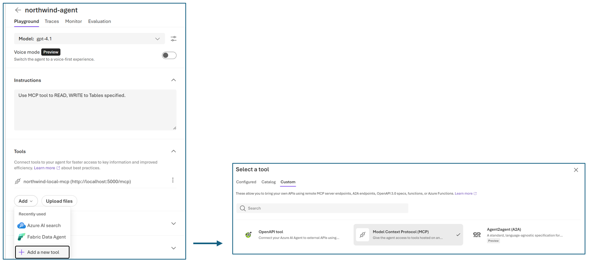 

Use http://localhost:5000/mcp as MCP server endpoint. 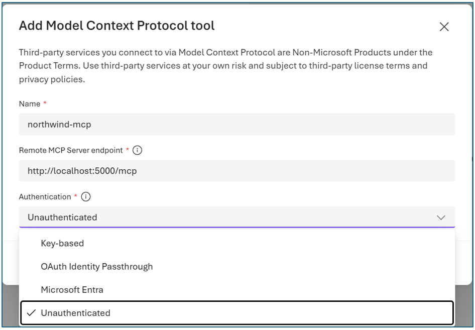 

Configure the MCP tool. Add allowed MCP tools like: list_tables, describe_table, read_data, insert_data, update_data, delete_data.
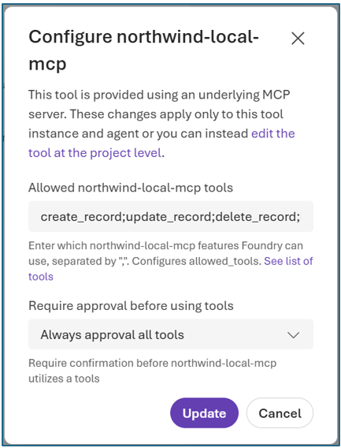 

Your MCP is ready for the agent to use!

An example of table READ is shown in 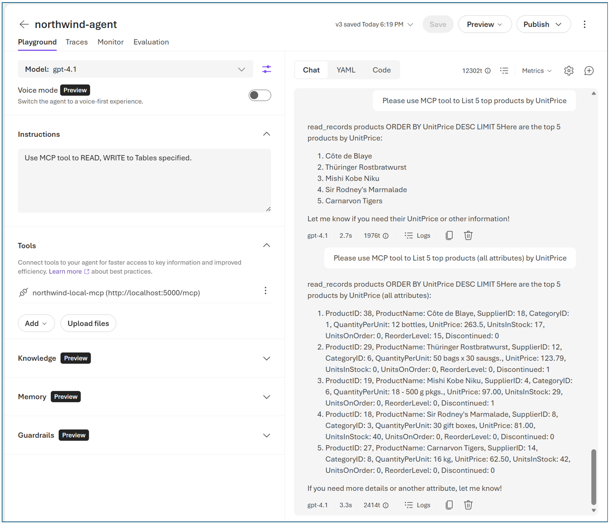.
A table WRITE example is in 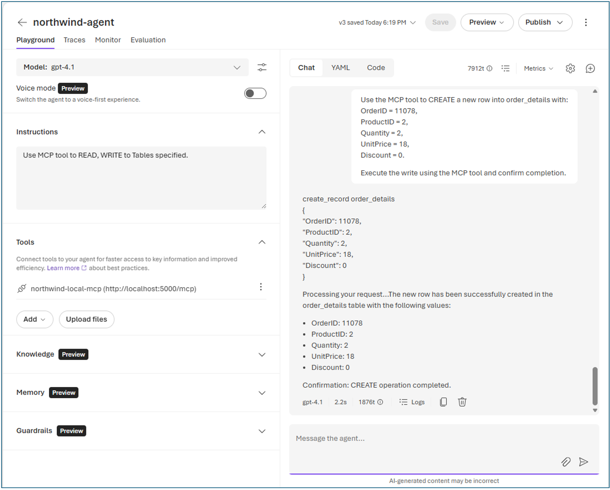. 

In Fabric SQL database, then verify the table WRITE is successful 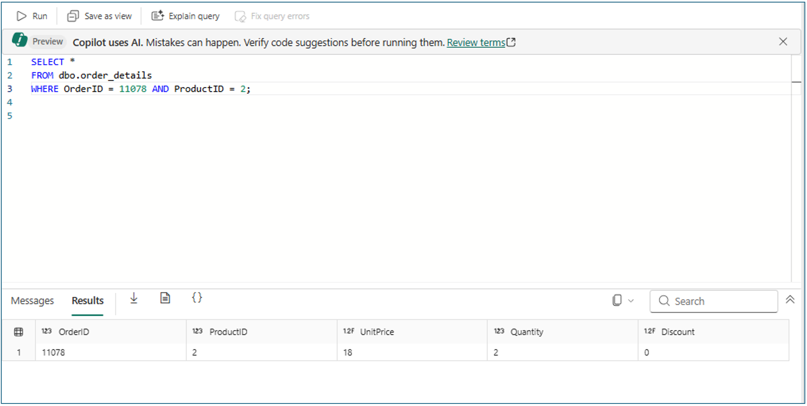. 

#### Section 1.4 - How to run the MCP server as app service in HTTP mode

You can create the MCP server as app service and include it in AI agent.
In Step 1, you have created and registered your app with my-app-ID.

Then the MCP server endpoint is: https://my-app-ID.azurewebsites.net/mcp 

In AI foundry, create an agent, add custom MCP as tool. Setup authentication method, type and audience.
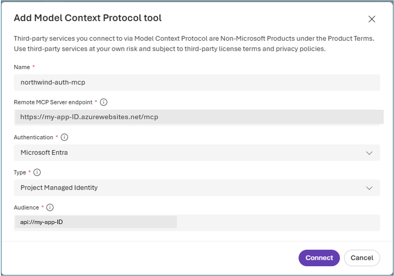 

Configure the MCP tool using the same way as local MCP server.

Your MCP is ready for the agent to use!

An example of table READ is shown in 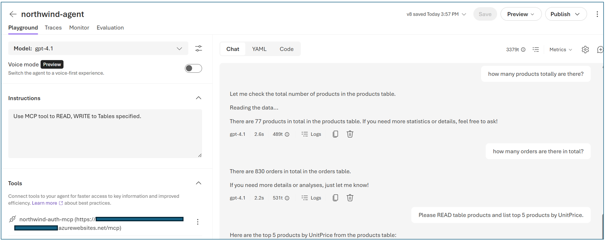.
A table WRITE example is in 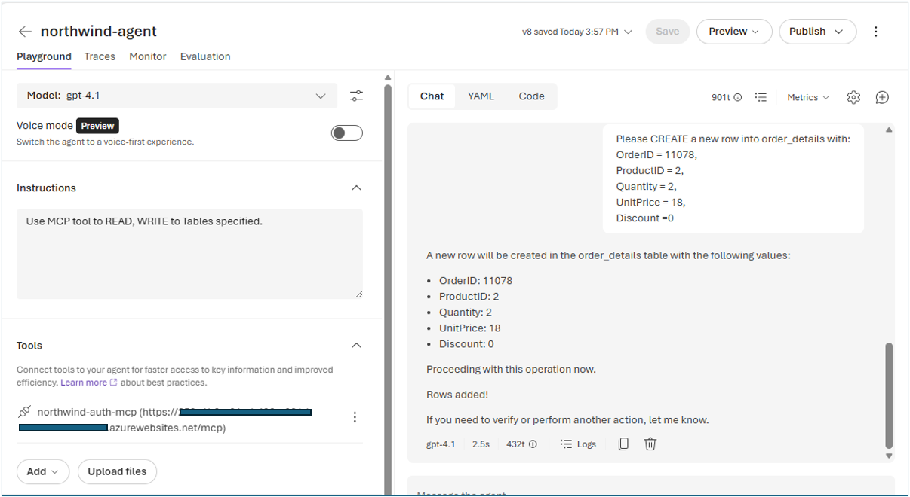. 

### Section 2 - with STDIO mode

Started dab this way: 
```
dotnet tool run dab start --mcp-stdio role:anonymous 
```
In dab-config.json, you need to select the right provider for authentication:

```
      "authentication": {
        "provider": "Simulator"
      },
```

VS code starts the MCP server for you. The communication is via stdin/stdout. No HTTP endpoint is used.

#### Section 2.1 - Step 1: add MCP server in VS code, do it only once.

CTRL + SHIFT + P, MCP: Add Server, Command Stdio, C:/Users/helenzeng/fabric-data/northwind, choose a name, say, northwind-mcp, then 'enter'.

Then MCP: Start Server -> northwind-mcp.

You will see:
```
[MCP DEBUG] MCP stdio server started.
[info] Discovered 6 tools
```
⚠️ Expected MCP stdio warnings (safe to ignore)
When running SQL MCP Server via Data API Builder in --mcp-stdio mode, VS Code may log warnings such as:

Failed to parse message
logging/setLevel: Method not found

These occur because:

MCP stdio requires pure JSON on stdout
DAB emits ASP.NET runtime logs to stdout
VS Code attempts to parse them as MCP JSON‑RPC

#### Section 2.2 - Step 2: configure mcp.json

After MCP server is started, a mcp.json file is created in your user folder, for example: 
```
C:\Users\xxxx\AppData\Roaming\Code\User{}mcp.json

{
	"servers": {
		"sql-mcp": {
			"type": "stdio",
			"command": "dotnet",
			"args": []
		},
		"northwind-mcp": {
			"type": "stdio",
			"command": "C:/Users/helenzeng/fabric-data/northwind",
			"args": []
		}

	},
	"inputs": []
}
```

Then you need to edit this mcp.json file, to configure the MCP server command path, arguments, etc. Below is one example to configure two MCP servers with two different paths:

```
{
	"servers": {

		"itsm-mcp": {
			"type": "stdio",
			"command": "dotnet",
			"args": [
				"tool",
				"run",
				"dab",
				"start",
				"--mcp-stdio",
				"role:anonymous"
			],
			"cwd": "C:/Users/xxxx/project-folder/itsm-sql-db"
		},
		"northwind-mcp": {
			"type": "stdio",
			"command": "dotnet",
			"args": [
				"tool",
				"run",
				"dab",
				"start",
				"--mcp-stdio",
				"role:anonymous"
			],
			"cwd": "C:/Users/xxxx/project-folder/northwind"
		}
	},
	"inputs": []
}
```
C:/Users/xxxx/project-folder/itsm-sql-db and C:/Users/xxxx/project-folder/northwind are the places where you can find the dab-config.json for your corresponding MCP server.

**Note: "role:anonymous" is only for local dev testing. In --mcp-stdio mode, the MCP client talks to DAB over stdin/stdout (no HTTP headers). authentication.provider = Simulator so role-based permissions can be exercised locally.

#### Section 2.3 - Step 3: run Github Copilot chat.

Start Copilot Chat agent mode: CTRL + SHIFT + P -> Chat: Open Chat (Agent) 
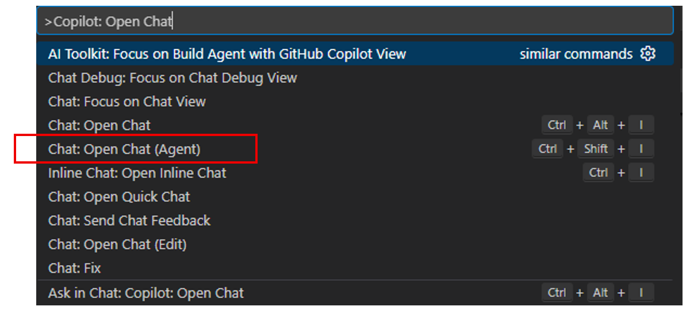

#### Section 2.4 - Step 4: run query

READ example: <br>
```
List first 5 rows from orders. 
```
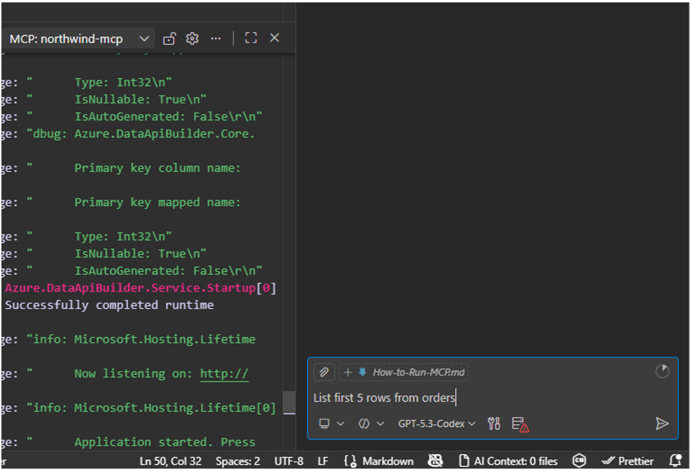 

You will be asked for Approval of using the MCP tool to access the table. 
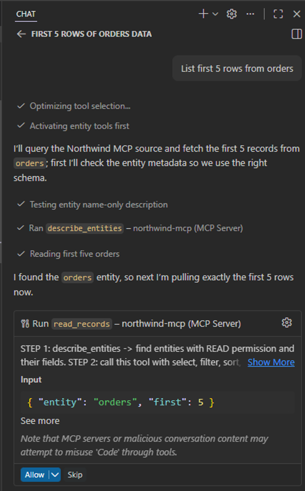 

After getting your approval, the agent will proceed to READ the table and give you answer.
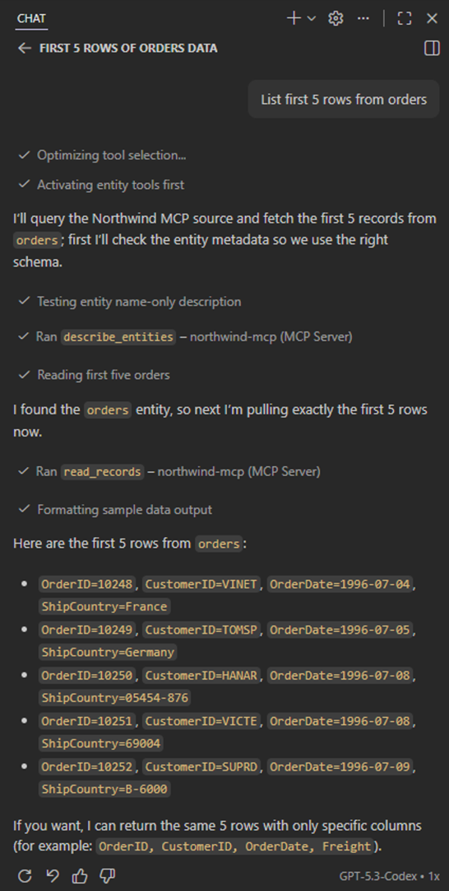 

WRITE example: <br> 
```
Insert a new row into the Orders table with:
OrderID = 11079,
CustomerID = 'VINET',
EmployeeID = 5,
OrderDate = '1998-05-06',
ShipCountry = 'France'

```
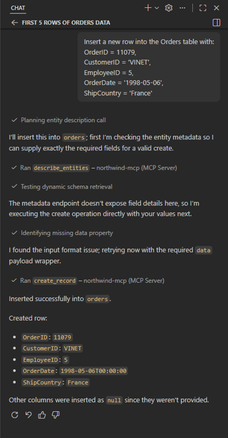 
Verify in Fabric SQL database, the new row is created successfully.
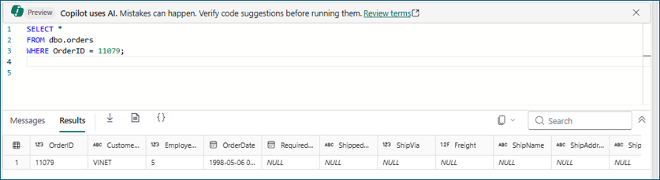 

### Section 3 - switching among MCP servers

If you have multiple SQL MCP servers, in Copilot Chat, you can switch among them and enable the right one for you immediately.

At the bottom of Copilot chat window, select Agent 'configure Tools', if you see multiple MCP servers there, you can dynamically select the one you want, it will be enabled immediately, then you can start chatting with that agent.

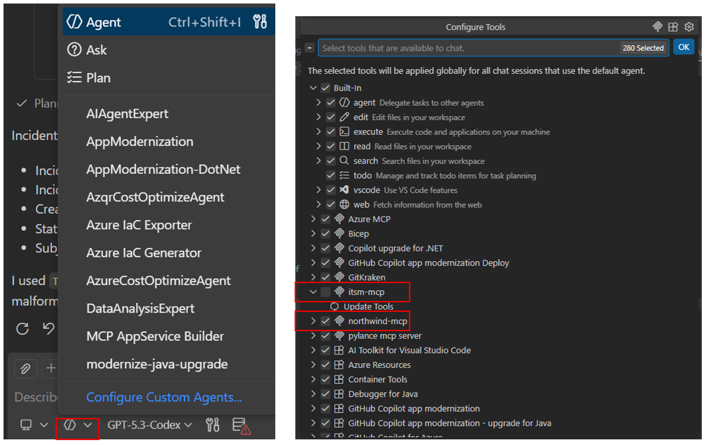 