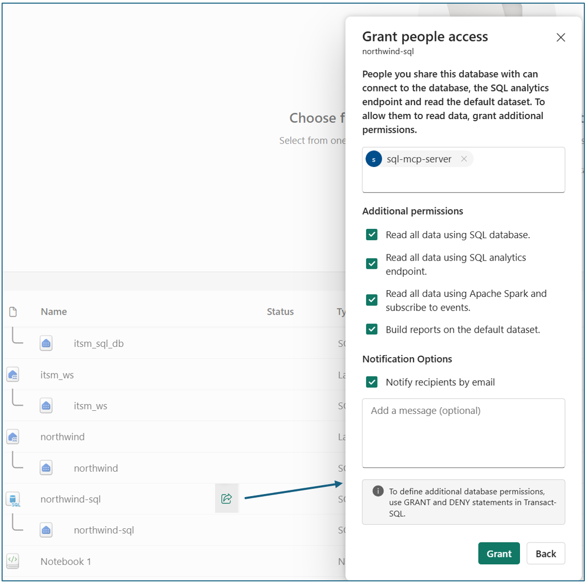
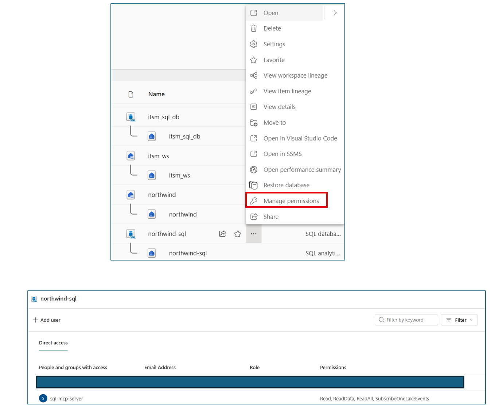
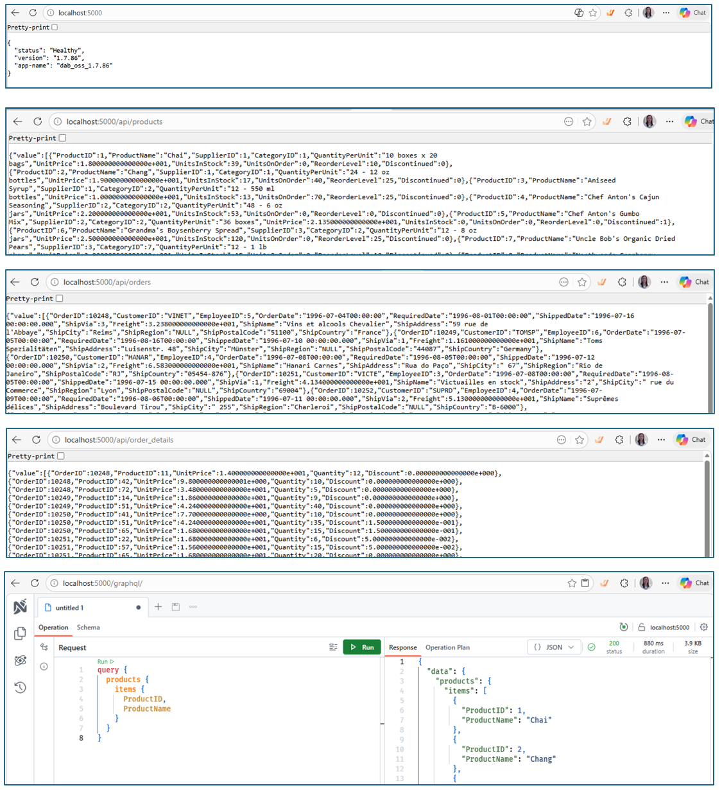

## 1. Goal

This repo provides a solution to create SQL MCP server, and towards multi-tenancy direction. <br>

When and why it is needed: customer have data in SQL database, i.e. tables, they want to develop agents to conduct reasoning over the data, and then take actions to update back to the database. a MCP is useful for this purpose, which provides tools to READ data from the SQL database and WRITE back. <br>

The technique behind the scene is DAB -- Data API Builder. By building on Data API builder's entity abstraction, RBAC, caching, and telemetry, the SQL MCP server delivers a production-ready surface that works the same across REST, GraphQL, and MCP. <br>

Reference: https://learn.microsoft.com/en-us/azure/data-api-builder/mcp/overview <br>

Client app ----------------> SQL MCP -------------------> SQL Database

### 1.1 Isolation strategy
This supports multiple isolation strategies, depending on the architecture:

#### Multi‑instance isolation
Each tenant uses a separate SQL database and connection string. It is a deployment‑level isolation strategy.

#### Identity‑based access control (RBAC)
Multiple tenants share the same SQL database and MCP server, but authenticate using different Microsoft Entra identities. <br>
SQL permissions restrict which tables or operations each tenant can perform.

#### True server‑side multi‑tenancy (recommended)
This repository focuses on building the foundation for the isolation, and is designed to evolve into true multi‑tenancy when the following conditions are implemented: <br>
All tenants share the same database and MCP server. <br>
Tenant isolation is enforced server‑side using a TenantId column, combined with SQL Row‑Level Security (RLS), views, or stored procedures. <br>
The MCP server resolves the tenant identity from authentication claims and ensures that all read and write operations are automatically scoped to the correct tenant. <br>

## 2. Preparation

SQL database in Microsoft Fabric. <br>
Some tables. In this examples, two tables: incident and problem. <br>
VS code studio with Powershell.  <br>
An app registered in Microsoft Entra ID, with application ID, tenant ID, and secret value. This app will be used as tenant to demonstrate how to prepare for multi-tenancy scenario. <br>

## 3. Outcome

A SQL MCP server ready to be included in AI agents. <br>
Steps are provided with exact powershell commands for users to follow. <br>
An UI will be generated for user to retrieve the tables 'incident' and 'problem', and a graphql UI for user to run query. <br>


## 4. Steps

### Step 0 - setup DAB tool

In Powershell:
```
dotnet new tool-manifest 
dotnet tool install microsoft.dataapibuilder --prerelease  
dotnet tool restore  

dotnet dab --version  
```
### Step 1 - setup connection to SQL database

Get these from SQL database in fabric, ADO.NET or JDBC connection string: <br>

In Powershell: 
```
$Server   = "xxxx.database.fabric.microsoft.com" 
$Port     = "1433" 
$Database = "example_sql_db-xxxxxxxx-xxxx-xxxx-xxxx-xxxxxxxxxxxx" 

Common JDBC-style options; adjust if your environment requires something different 
$ConnStr  = "Server=tcp:$Server,$Port;Database=$Database;Encrypt=True;TrustServerCertificate=True;" 

dab init --database-type mssql --host-mode Development --connection-string "$ConnStr" 
```
if failed, run this: <br>

```
dotnet tool run dab init ` 
  --database-type mssql `   
  --host-mode Development `  
  --connection-string "$ConnStr"  
```

add tables: <br>

```
$Tables = @(  
  "incident",  
  "problem"  
)

foreach ($t in $Tables) {  
  dotnet tool run dab add $t `  
    --source "dbo.$t" `  
    --permissions "authenticated:*"  
}
```

### Step2A - register app, to use this app identity representing a tenant

register app: sql-msp-server in Microsoft Entra ID  <br>
application (client) ID: yyyyyyyy-yyyy-yyyy-yyyy-yyyyyyyyyyyy  <br>
applicaion secret value (don't use secret ID): zzzzzzzzzzz  <br>

grant fabric workspace permissions  <br>
Add your app sql-mcp-server  <br>
Role: Contributor (minimum for SQL DB access)  <br>

### Step 2B - grant permission for the app to access the SQL database

-- create Entra-backed database user, run in fabric sql query: 
```
CREATE USER [sql-mcp-server] FROM EXTERNAL PROVIDER;  
GO 
```
-- grant read/write permissions  <br>

```
ALTER ROLE db_datareader ADD MEMBER [sql-mcp-server]; 
ALTER ROLE db_datawriter ADD MEMBER [sql-mcp-server]; 
GO
```

Example of permission is showin in this image.  and  

### Step 2C - build service principal connection string (headless)

```
$ClientId="yyyyyyyy-yyyy-yyyy-yyyy-yyyyyyyyyyyy" 
$ClientSecret="zzzzzzzzzzz" 

$ConnStr = @" 
Server=tcp:$Server,$Port;  
Database=$Database;  
Authentication=Active Directory Service Principal; 
User ID=$ClientId;
Password=$ClientSecret; 
Encrypt=True; 
TrustServerCertificate=False; 
"@ -replace "\r?\n",""  


dab init --database-type mssql --host-mode Development --connection-string "$ConnStr" 
```
### Step 3 - re-initialize SQL MCP (DAB config)

```
dotnet tool run dab init `  
  --database-type mssql ` 
  --host-mode Development ` 
  --connection-string "$ConnStr"  
```
If fail, then try the following method:

```
$Env:SQL_CONNECTION_STRING = `  
"Server=tcp:xxxx.database.fabric.microsoft.com,1433;  
Database=example_sql_db-xxxxxxxx-xxxx-xxxx-xxxx-xxxxxxxxxxxx;  
Encrypt=True;  
TrustServerCertificate=False;  
Authentication=Active Directory Service Principal;  
User Id=yyyyyyyy-yyyy-yyyy-yyyy-yyyyyyyyyyyy;  
Password=zzzzzzzzzzz"  

then use @env('SQL_CONNECTION_STRING') in dab-config.json for 'connection-string'.
```
### Step 4.1 - add a surrogate key

This step is needed if the tables don't have Primary Key. <br>

Run the following in Fabric SQL query space: <br>

```
ALTER TABLE dbo.incident  
ADD IncidentPk INT IDENTITY(1,1) NOT NULL;  

ALTER TABLE dbo.incident  
ADD CONSTRAINT PK_incident PRIMARY KEY (IncidentPk);  

ALTER TABLE dbo.problem  
ADD ProblemPk INT IDENTITY(1,1) NOT NULL; 

ALTER TABLE dbo.problem 
ADD CONSTRAINT PK_problem PRIMARY KEY (ProblemPk); 
```
### Step 4.2 - update DAB entities to use the surrogate PKs

This repository provides a simple example of setting anonymous persmission on tables. <br>
```
dotnet tool run dab add incident ` 
  --source dbo.incident ` 
  --source.type table ` 
  --source.key-fields IncidentPk ` 
  --permissions "anonymous:*" 

dotnet tool run dab add problem ` 
  --source dbo.problem ` 
  --permissions "anonymous:*" ` 
  --key-fields ProblemPk 
```
or you can update dab-config.json directly to reflect the surrogate keys

### Step 5 - start the dab 

```
dotnet tool run dab validate 
dotnet tool run dab start 
-- This will start MCP in HTTP mode. 

dotnet tool run dab start --mcp-stdio role:anonymous 
-- This will start MCP in Stdio mode. 
```
### Step 6 - REST APIs

After the DAB is started, you will see these UIs as shown in the image.  

http://localhost:5000/api/incident <br>
http://localhost:5000/api/problem <br>

GraphQL <br>
http://localhost:5000/graphql <br>

Try the following: <br>
```
query { 
  incidents { 
    items {  
      IncidentPk  
      RecId 
    } 
  } 
}  
```
MCP endpoint is live at: http://localhost:5000/mcp

### Step 7 - How to run and use the MCP server

Please refer to https://github.com/helenzusa1/sql-mcp-server/blob/main/How-to-Run-MCP.md 

