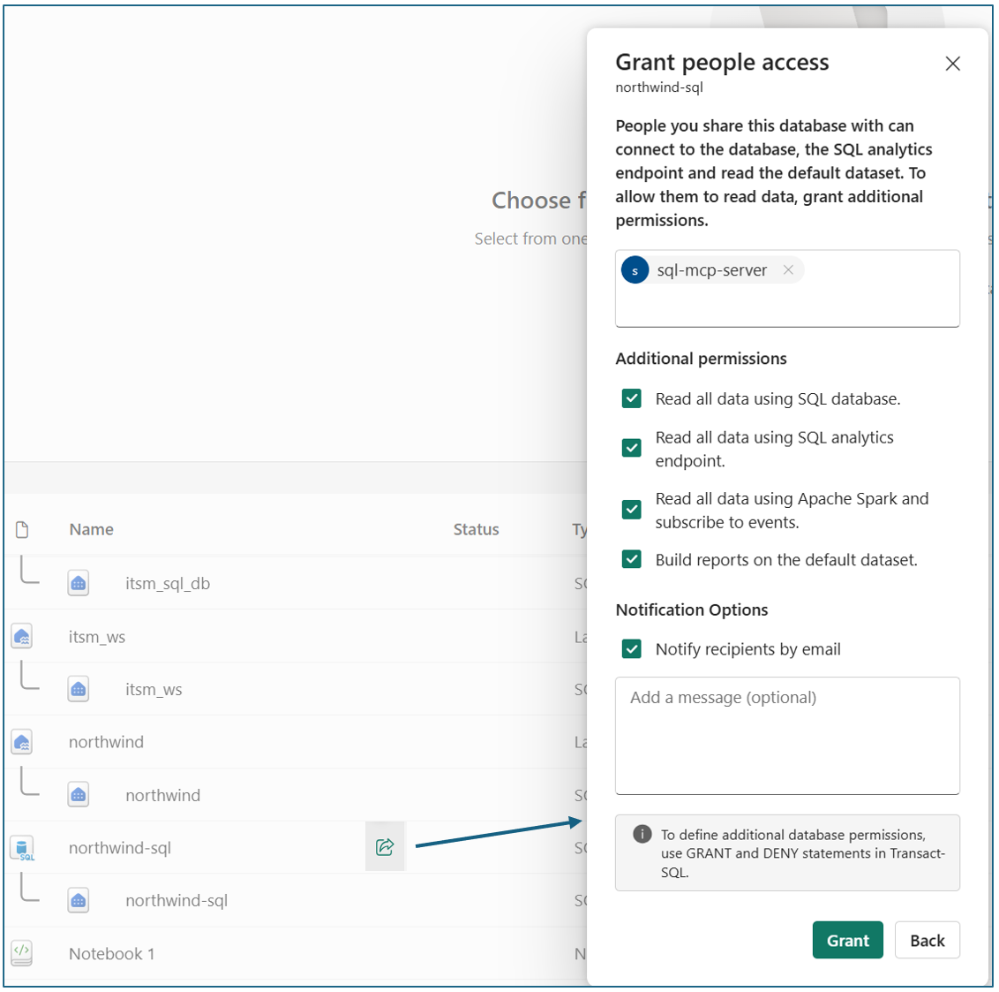
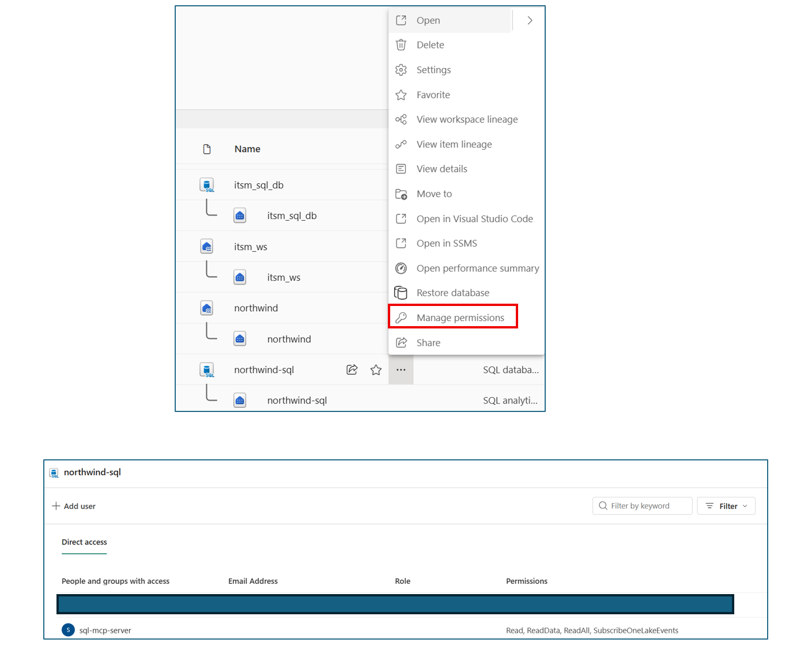
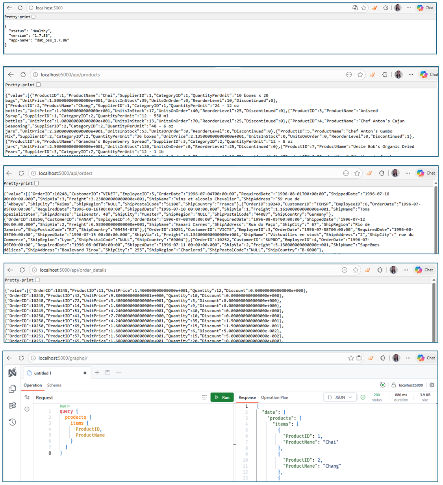

## 1. Goal

You have SQL database, and have Tables ready, you wonder how to create SQL MCP server, and how to run the server after it's built?

This article uses Fabric SQL database as an example, gives you complete steps from setting up client Service Principal, RBAC, DAB configuration, to start the SQL MCP server and run the server.

Code example is here: https://github.com/helenzusa1/sql-mcp-server

The solution provided in this repo is prepared for evolving towards multi-tenancy direction. <br>

### 1.1 Isolation strategy
This supports multiple isolation strategies, depending on the architecture:

#### Multi‑instance isolation
Each tenant uses a separate SQL database and connection string. It is a deployment‑level isolation strategy.

#### Identity‑based access control (RBAC)
Multiple tenants share the same SQL database and MCP server, but authenticate using different Microsoft Entra identities. <br>
SQL permissions restrict which tables or operations each tenant can perform.

#### True server‑side multi‑tenancy (recommended)
This repository focuses on building the foundation for the isolation, and is designed to evolve into true multi‑tenancy when the following conditions are implemented: <br>
All tenants share the same database and MCP server. <br>
Tenant isolation is enforced server‑side using a TenantId column, combined with SQL Row‑Level Security (RLS), views, or stored procedures. <br>
True server-side multi-tenancy requires explicit configuration. DAB/SQL MCP Server won’t automatically scope requests by tenant unless you implement: (1) Entra authentication, (2) role/claim mappings or policies, and (3) database enforcement such as Row-Level Security (RLS), tenant-filtered views, or stored procedures. The MCP layer can then rely on those policies to ensure tenant isolation. <br>

## 2. Preparation

SQL database in Microsoft Fabric. <br>
Some tables. In this examples, three tables: products, orders and order_details. <br>
VS code studio with Powershell.  <br>
An app registered in Microsoft Entra ID, with application ID, tenant ID, and secret value. This app will be used as tenant to demonstrate how to prepare for multi-tenancy scenario. <br>

## 3. Outcome

DAB is running and you can validate endpoints via Swagger (REST) and GraphQL tooling. DAB exposes REST and GraphQL endpoints based on your configuration. The ‘UI’ you see is the Swagger/OpenAPI experience (for REST) and the GraphQL playground — not a custom database UI. You can retrieve the tables through Swaggr UI, and run query in GraphQL. <br>

A SQL MCP server ready to be included in AI agents. <br>
Steps are provided with exact powershell commands for users to follow. <br>


## 4. Steps

### Step 0 - Install DAB tool

In Powershell:
```
dotnet new tool-manifest 
dotnet tool install microsoft.dataapibuilder --prerelease  
dotnet tool restore  

dotnet dab --version  
```

After this, you should see .config subfolder created under your project folder, and dotnet-tools.json created inside .config.


### Step 1 - Register Entra app (service principal), representing a user

register app: sql-msp-server in Microsoft Entra ID  <br>
application (client) ID: yyyyyyyy-yyyy-yyyy-yyyy-yyyyyyyyyyyy  <br>
applicaion secret value (don't use secret ID): zzzzzzzzzzz  <br>

grant fabric workspace permissions  <br>
Add your app sql-mcp-server  <br>
Role: Contributor (minimum for SQL DB access)  <br>

### Step 2 - Grant SQL permissions to the app

-- create Entra-backed database user, run in fabric sql query: 
```
CREATE USER [sql-mcp-server] FROM EXTERNAL PROVIDER;  
GO 
```
-- grant read/write permissions  <br>

```
ALTER ROLE db_datareader ADD MEMBER [sql-mcp-server]; 
ALTER ROLE db_datawriter ADD MEMBER [sql-mcp-server]; 
```
Change db_owner only if you need schema changes or admin operation.
```
ALTER ROLE db_owner ADD MEMBER [sql-mcp-server];
GO
```

Example of permission is showin in this image.  and  


### Step 3 - Build service-principal connection string

```
$Env:SQL_CONNECTION_STRING = `  
"Server=tcp:xxxx.database.fabric.microsoft.com,1433;  
Database=example_sql_db-xxxxxxxx-xxxx-xxxx-xxxx-xxxxxxxxxxxx;  
Encrypt=True;  
TrustServerCertificate=False;  
Authentication=Active Directory Service Principal;  
User Id=yyyyyyyy-yyyy-yyyy-yyyy-yyyyyyyyyyyy;  
Password=zzzzzzzzzzz"  
```

### Step 4 - Initializa DAB config (dab init)

Get these from SQL database in fabric, ADO.NET connection string: <br>

In Powershell: 
```

dab init --database-type mssql --host-mode Development --connection-string "$Env:SQL_CONNECTION_STRING"
```
if failed, run this: <br>

```
dotnet tool run dab init --database-type mssql --host-mode Development --connection-string "$Env:SQL_CONNECTION_STRING"  
```

After this, you should see dab-config.json is created in your project folder.

You should initialize DAB only once, then update table key-field, permission. For 'Connection-string', you can use the full parameter value, or you can use @env('SQL_CONNECTION_STRING').

```
{
  "$schema": "https://github.com/Azure/data-api-builder/releases/download/v1.7.86/dab.draft.schema.json",
  "data-source": {
    "database-type": "mssql",
    "connection-string": "@env('SQL_CONNECTION_STRING')",
    "options": {
      "set-session-context": false
    }
  },
  "runtime": {
    "rest": {
      "enabled": true,
      "path": "/api",
      "request-body-strict": true
    },
    "graphql": {
      "enabled": true,
      "path": "/graphql",
      "allow-introspection": true
    },
    "mcp": {
      "enabled": true,
      "path": "/mcp"
    },
    "host": {
      "cors": {
        "origins": [],
        "allow-credentials": false
      },
      "authentication": {
        "provider": "AppService"
      },
      "mode": "development"
    }
  },

"entities": {
  "products": {
    "source": {
      "object": "dbo.products",
      "type": "table",
      "key-fields": ["ProductID"]
    },
    "permissions": [
      { "role": "authenticated", "actions": [{ "action": "*" }] }
    ]
  },

 _**** same for other tables.
}
}
```
### Step 5 - Start DAB (HTTP or STDIO) 

There are two ways to start DAB:

```

dotnet tool run dab start 
-- This will start MCP in HTTP mode. 

dotnet tool run dab start --mcp-stdio role:anonymous 
-- This will start MCP in Stdio mode. 
```

If you used @env('SQL_CONNECTION_STRING') in dab-config.json for 'connection-string', then every time before you start dab, you need to set the $Env:SQL_CONNECTION_STRING.

### Step 6 - REST APIs

After the DAB is started in either HTTP or STDIO mode, you can launch Swagger UIs as shown in the image.  

http://localhost:5000/api/products <br>
http://localhost:5000/api/orders <br>
http://localhost:5000/api/order_details <br>

GraphQL <br>
http://localhost:5000/graphql <br>

Try the following: <br>
```
query { 
  products { 
    items {  
      ProductID,
      ProductName
    } 
  } 
}  
```
But the method of running the MCP server is different for HTTP and STDIO mode. 

### Step 7 - How to run and use the MCP server

Please refer to https://github.com/helenzusa1/sql-mcp-server/blob/main/How-to-Run-MCP.md 

